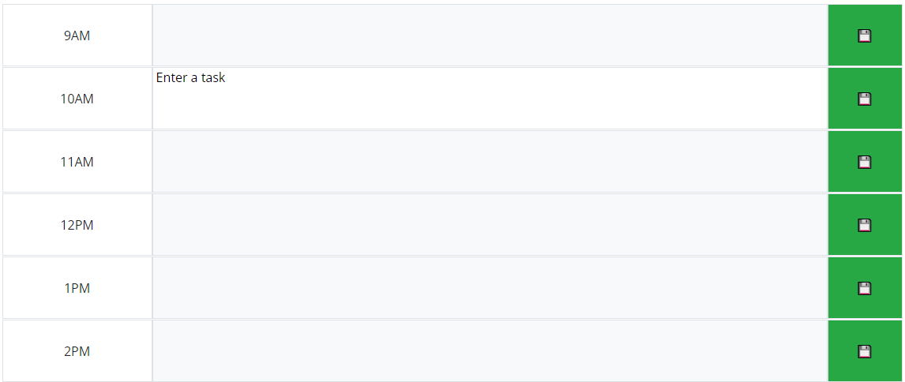

# Work Day Scheduler

This project allows the user to schedule tasks during the workday.  It generates a set of blocks for each hour that are color coded based on whether they have already past, are the current hour, or are upcoming.  Tasks are stored between sessions in local storage.  To edit a task, click on the corresponding text box, then click the save button to update it.

## Screenshots

